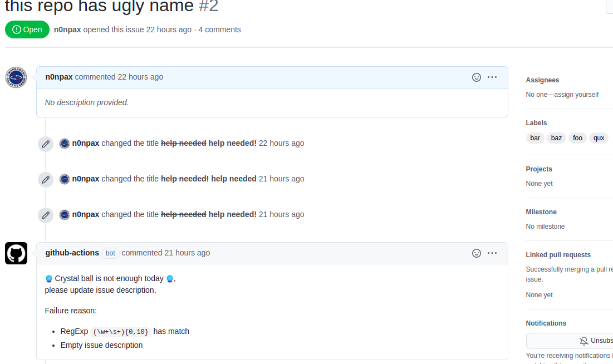

[](https://app.codacy.com/gh/n0npax/crystal-ball?utm_source=github.com&utm_medium=referral&utm_content=n0npax/crystal-ball&utm_campaign=Badge_Grade_Settings)
[](https://codecov.io/gh/n0npax/crystal-ball)
[](https://badges.mit-license.org)
[](https://GitHub.com/n0npax/crystal-ball/issues/)


# Crystal Ball

Crystal ball is an easy app to check if github an issue can be consider as invalid or dummy. It's also a `GitHub` action which simplify usage.

## Problem to solve

From time to time we are expecting issues which are not actionable.

An empty issue body is an example of unactionable issue.
Simillarly if an issue template with a checklist is given but no field is selected it's possible to consider an issue as not ready to be triaged.

The `Crystal Ball` action will check an issue description and responds to it based on predefined checks or customer provided regular expressions.

---

## Usage

### Action example

```yaml
name: crystall ball
on:
  issues:
    types: [opened, edited]
jobs:
  fortune_teller:
    runs-on: ubuntu-latest
    name: Fortune teller
    steps:
      - name: Checkout
        uses: actions/checkout@v2
      - name: Crystal Ball
        # rm line below if you want to apply same rules for PR description
        if: ${{ !github.event.issue.pull_request }}
        uses: n0npax/crystal-ball@v1.0.0
        env:
          GITHUB_TOKEN: ${{ secrets.GITHUB_TOKEN }}
          CRYSTAL_MATCH_REGEX_BAR: 'description:?\s*\Z'
          CRYSTAL_NOMATCH_REGEX_FOO: '(\w+\s+){0,10}'
          # COMMENT_MSG: blah blah blah
        with:
          repoName: ${{ github.repository	}}
          issueNum: ${{ github.event.issue.number }}
          labels: "invalid,crystall ball needed"
```

### ENV variables

Default comment message can be changed by:
```yaml
COMMENT_MSG: "comment message (above failure reason)
```
Multiple regular expressions can be used to validate an issue body. Any ENV variable starting with `CRYSTAL_{NO,}MATCH_REGEX` will be used. If match does/doesn't exists, the issue is considered as invalid and crystal ball will comment it.
```yaml
CRYSTAL_NOMATCH_REGEX_FOO: '^foo$'
CRYSTAL_MATCH_REGEX_BAR: 'bar{4}'
```
Github token is required to perform actions.
```yaml
GITHUB_TOKEN: ${{ secrets.GITHUB_TOKEN }}
```

---

## Example

How the action may look like:



### Live demo

Just raise an issue with an empty body [here](https://github.com/n0npax/crystal-ball/issues/new).

---

## LICENSE

Code under the [MIT license](https://opensource.org/licenses/MIT).
